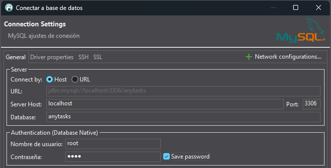
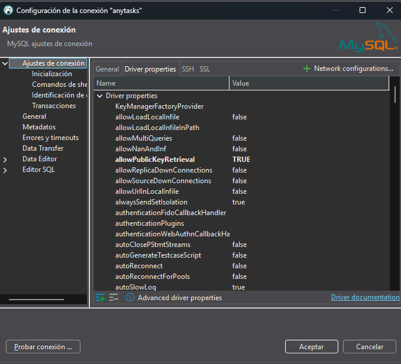

# Gestor de Tareas estilo Kanban - AnyTasks

AnyTasks es una herramienta de gestión de tareas inspirada en el estilo Kanban, pensada para quienes buscan una opción sencilla pero eficaz frente a herramientas más complejas como Jira o Trello.

Con AnyTasks, puedes gestionar tus tareas de manera rápida y eficiente, asignar etiquetas personalizadas y definir prioridades según lo necesites. Además, puedes añadir comentarios y adjuntar archivos, manteniendo un historial detallado de todos los cambios realizados.

La idea es ofrecer una alternativa práctica, clara y visualmente atractiva, enfocada principalmente al uso personal, para que puedas mantener el control de tus tareas sin complicaciones innecesarias.

## Características

- 📝 **Gestión de tareas**: Crea, edita y elimina tareas.
- 🗂️ **Clasificación de tareas**: Organiza las tareas cambiandolas de columna y asignales etiquetas personalizadas.
- 🚦 **Estado de tareas**: Cada tarea puede tener un estado como "Pendiente", "En progreso" o "Hecho".
- 🔥 **Prioridades**: Asigna prioridades a las tareas (Baja, Media, Alta).
- 📎 **Archivos adjuntos**: Permite adjuntar archivos a las tareas.

## Tecnologías Utilizadas

- **Frontend**: React con Tailwind CSS
- **Backend**: Express.js
- **Base de Datos**: MySQL
- **ORM**: Sequelize ORM

## Base de Datos

### Tablas / modelos:

- **Users**: Información de usuarios como nombre, correo y contraseña.
- **Boards** Tablero principal la cual contendrá las columnas y las tareas.
- **Columns** Columnas que representan el estado de las tareas que contienen, estas estarán asociadas a un tablero.
- **Tasks**: Tareas con título, descripción, vencimiento, estado, prioridad y usuario asociado.
- **Tags**: Etiquetas libres para clasificar tareas de forma flexible.
- **\*Task_Tags**: Relación muchos a muchos entre tareas y etiquetas.
- **Attachments**: Archivos adjuntos relacionados a tareas.

### Diagrama completo de la Base de Datos:


## Instalación

### Paso 1 -Descarga e instalación del proyecto

**Paso 1.1 - Clonar el Repositorio**

Clona el repositorio en tu máquina local:

```bash
git clone https://github.com/AdriGarcia75/TFG-CFGS-DAW.git
cd ./anytasks
```

**Paso 1.2 - Descargar e instalar dependencias**

Instala las dependencias necesarias para el proyecto en ambas carpetas server y client.
Para la carpeta de _server_

```bash
cd server/
npm install
```

Para la carpeta de _client_

```bash
cd ../client/
npm install
```

### Paso 2 - Creación de Base de Datos y Migraciones

⚠️ **IMPORTANTE:** Asegúrate de tener MySQL Server instalado y que el proceso de **MySQL Server** esté en ejecución antes de continuar.

### Paso 2.1 - Creación del conector de la BBDD

Ahora crearemos un conector de la BBDD, así podemos consultarla desde nuestro gestor (recomiendo utlizar DBeaver).


> Si da error, seguramente sea por el parámetro de "Database". Este da por hecho de que **ya existe** una BBDD del mismo nombre, dejar vacío si decides crearla en el siguiente paso (Método 2)

### Paso 2.2 - Editar el conector de la BBDD

Esta opción se habilita debido a que a partir de la versión 8 o superior de MySQL se usa un método de autenticación que requiere la recuperación de la clave pública para establecer la conexión correctamente.


### Paso 2.3 - Migraciones (y creacíón de la BBDD desde terminal)

> ❗ **Nota:** Abre el proyecto en Visual Studio Code o en otro IDE, navega al archivo _.env_ en _./server/_ y cambía si es necesario las credenciales de tu gestor de BBDD (nombre y contraseña).

#### Método 1: Creación manual de la base de datos

1. Abre **DBeaver** u otro gestor de bases de datos MySQL.
2. Crea una base de datos llamada `anytasks` o el nombre que hayas configurado en el _.env_ de _./server/_.
3. Abre **Visual Studio Code** y navega a la carpeta `/server`.
4. Ejecuta el siguiente comando en la terminal:

```bash
npx sequelize-cli db:migrate
```

#### Método 2: Creación automática de la BBDD desde la terminal

1. Abre **Visual Studio Code** y navega a la carpeta `/server`.
2. Ejecuta los siguientes comandos en la terminal:

```bash
npx sequelize-cli db:create
npx sequelize-cli db:migrate
```

### Paso 3 - Configuración de .env para server y client
Hay que configurar un archivo _.env_ en ambas raices de client y server

**Client**
Para /client, crear en la raiz del front (es decir, ./client/) un fichero _.env_ con el siguiente formato
```
PORT="[Insertar puerto, recomendado el 8080]"
```

**Server**
**Client**
Para /client, crear en la raiz del front (es decir, ./client/) un fichero _.env_ con el siguiente formato
```
DB_USER="[Nombre de usuario de la bbdd]"
DB_PASSWORD="[El password del respectivo usuario de la bbdd]"
DB_NAME="[El nombre puede ser cualquiera, mientras coincida con la base de datos, se recomienda utilizar anytasks]"
DB_HOST="[No es obligatorio, pero para localhost (lo recomendado), utilizar 127.0.0.1]"
DB_DIALECT="mysql"

JWT_SECRET_KEY="[Insertar tu jwt secret key, una frase secreta, se recomienda una string hexadecimal de 64 caracteres]"
```
