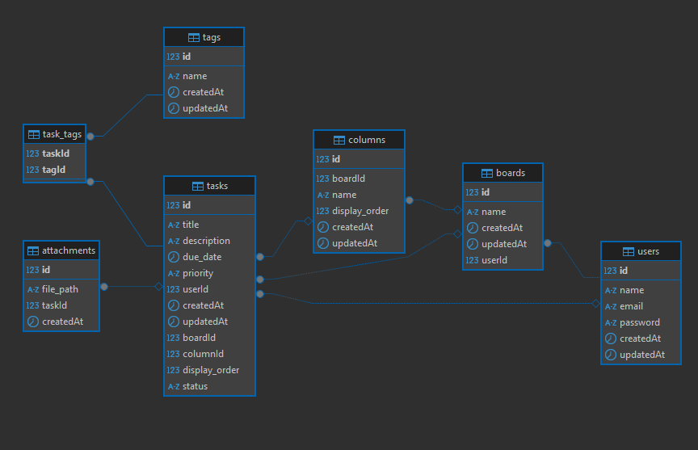

# Gestor de Tareas estilo Kanban - AnyTasks

AnyTasks es una herramienta de gestión de tareas inspirada en el estilo Kanban, pensada para quienes buscan una opción sencilla pero eficaz frente a herramientas más complejas como Jira o Trello.

Con AnyTasks, puedes gestionar tus tareas de manera rápida y eficiente, asignar etiquetas personalizadas y definir prioridades según lo necesites. Además, puedes añadir comentarios y adjuntar archivos, manteniendo un historial detallado de todos los cambios realizados.

La idea es ofrecer una alternativa práctica, clara y visualmente atractiva, para que puedas mantener el control de tus tareas, ya sean personales o en equipo, sin complicaciones innecesarias.

## Características

- 📝 **Gestión de tareas**: Crea, edita y elimina tareas.
- 🗂️ **Clasificación de tareas**: Organiza las tareas en categorías y asigna etiquetas personalizadas.
- 🚦 **Estado de tareas**: Cada tarea puede tener un estado como "Pendiente", "En progreso" o "Hecho".
- 🔥 **Prioridades**: Asigna prioridades a las tareas (Baja, Media, Alta).
- 💬 **Comentarios**: Los usuarios pueden agregar comentarios a las tareas.
- 📎 **Archivos adjuntos**: Permite adjuntar archivos a las tareas.
- 📜 **Historial de cambios**: Un registro de los cambios realizados en cada tarea, como cambios de estado o prioridad.
- 🔁 **Tareas recurrentes**: Puedes configurar tareas que se repiten de forma diaria, semanal o mensual.

## Tecnologías Utilizadas

- **Frontend**: React con Tailwind CSS
- **Backend**: Node.js con Express
- **Base de Datos**: MySQL (base de datos relacional)
- **Autenticación**: por decidir si a mano o via libreria (seguramente esta opción)
- **ORM**: Sequelize

## Base de Datos

### Tablas / modelos:

1. **Users**  
   Almacena información de los usuarios, como su nombre, correo y contraseña.

2. **Tasks**  
   Incluye título, descripción, fecha de vencimiento, estado y prioridad. Cada tarea está vinculada a un usuario.

3. **Projects**  
   Contiene nombre y descripción de los proyectos.

4. **Task_Projects**  
   Relación muchos a muchos entre tareas y proyectos.

5. **Categories**  
   Clasificación de tareas mediante categorías con nombre y descripción.

6. **Task_Categories**  
   Relación muchos a muchos entre tareas y categorías.

7. **Tags**  
   Etiquetas libres para clasificación flexible de tareas.

8. **Task_Tags**  
   Relación muchos a muchos entre tareas y etiquetas.

9. **Comments**  
   Comentarios de los usuarios asociados a tareas.

10. **Attachments**  
    Archivos adjuntos relacionados a tareas (documentos, imágenes, etc.).

11. **Task_History**  
    Historial de cambios en tareas: estado, prioridad, etc.

### Diagrama completo de la Base de Datos:

## Instalación
TO DO
